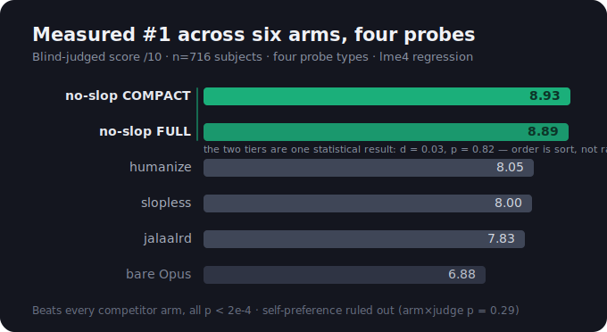
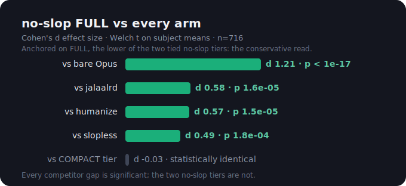
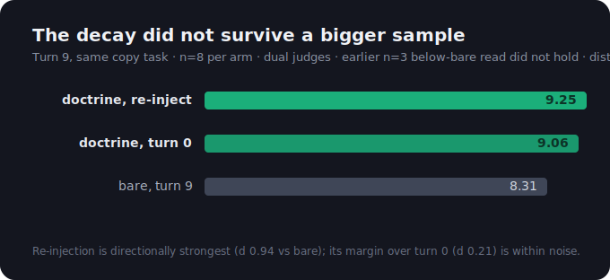

# no-slop

A behavioral doctrine and enforcement layer that makes Claude Opus write and judge like a stronger model, measured #1 against every published competitor under blind judging.

## The result

Under a mixed-effects regression on 716 subjects and 1,396 blind judgments across four probe types, which doctrine the model runs under explains score differences at p < 2.2e-16. The two no-slop tiers rank #1 and #2 (compact 8.93, full 8.89, statistically indistinguishable at d = 0.03) and beat every competitor arm in the regression — the three strongest published packs — with real effect sizes, d = 0.49 to 0.58 against those packs and d = 1.21 against bare, all p < 2e-4; the five weaker packs had already been eliminated head-to-head on the [leaderboard](evals/leaderboard.md). The self-preference threat is ruled out: judge model matters, but the arm-by-judge interaction is non-significant (p = 0.285), and the ranking holds on every probe taken on its own.

## Leaderboard: highest-n head-to-head per field

Won 7 of 8 fields outright, tied 1, lost 0 at the highest-n measurement of each cell.

| Field | no-slop v12 | Best competitor |
|---|---|---|
| Advice (P6) | **9.88** | humanize 8.50 |
| Marketing copy (P7) | **8.75** | humanize 6.75 |
| Client email (P13) | **9.50** | jalaalrd 8.75 |
| Lay explainer (P14) | **9.75** | slopless 8.50 |
| Longform 500w (P16) | **8.75** | humanize 8.25 |
| De-slop rewrite (P17) | **10.00** | humanize 9.25 |
| Empathy + substance (P18) | **9.50** | slopless 9.00 |
| Social register (P19) | 8.50 | humanize 8.50 (tie) |

## What it is

Five deployment tiers off one source of truth. FULL is the always-on identity; the rest are distillations and harness slots.

| Tier | Size | Role |
|---|---|---|
| FULL | ~5,700 words | Always-on identity, shapes every response from the first token |
| COMPACT | ~3,900 words | Matched FULL at n=716 (d=0.03); the tier to use when tokens matter |
| KERNEL | ~700 words | Top procedures only; doubles as a subagent preamble |
| SKILL | invocable | Loads the full doctrine on `/no-slop`, kernel inlined as fallback |
| OUTPUT_STYLE | harness slot | Drops the doctrine into the Claude Code output-style channel |

The doctrine itself is five pillars: epistemic discipline (how to know), judgment (how to decide), design taste (how to shape things), communication (how to say it), and execution (how to act over time). Every rule pairs a trigger with an action and names its failure mode; a priority ladder resolves collisions.

## How it was tested

- A powered [factorial regression](evals/results-factorial.md): 6 arms x 4 probe types, n=716, dual Opus and Sonnet judges, `total ~ arm + probe + judge + arm:judge + (1|subject)` in lme4, which is where the p < 2.2e-16 arm effect and the ruled-out self-preference come from.
- A competitive [leaderboard](evals/leaderboard.md) against every retrievable published pack under identical harsh blind judging, with contested cells settled at n=4 after small-n competitor highs regressed by 1.9 to 5.3 points.
- A [blind-spot battery](evals/results-blindspots.md) of about 430 agents covering doctrine half-life, over-refusal, sycophancy under pressure, and six new probe types, which surfaced the real limits below rather than hiding them.
- Roughly 3,900 agents across 13+ trial rounds and waves and 5 adversarial panels, with the separation isolated to sentence-shape (c4) and form (c5), where a doctrine adds most on a substance floor the base model already clears.

## Install

Pick the surface, copy the file.

- CLAUDE.md import (Tier 1): copy `doctrine/FULL.md` next to your user memory and add `@no-slop-full.md` to `~/.claude/CLAUDE.md`. Use `COMPACT.md` the same way when context is tight.
- Output style: drop the generated output style into the Claude Code output-style slot for harness-level enforcement.
- Skill: install `skill/SKILL.md` with copies of `FULL.md` and `TELLS.md` beside it; `/no-slop` loads the full doctrine on demand.
- Raw API: prepend `FULL.md` or `KERNEL.md` to the system prompt (see `harness/prefill.md` for artifact-first delivery). The doctrine defers to platform and project instructions on conflict, so it stacks safely.

## Honest limitations

- The doctrine held its edge over conversational distance: a turn-9 score of 9.06 against 8.31 for bare on the same task, at n=8 per arm. The earlier below-bare decay did not reproduce and was an n=3 cell; re-injection at the task moment was directionally strongest at 9.25.
- A wrapper or preamble floor persists in chat-delivered artifacts; the mechanical fix is routing the artifact to a file rather than instructing it away.
- The factorial's two added probes required reconstruction: the original P17 stimulus survived only truncated, so the extension runs a reconstructed P17r, disclosed in the writeup; historical P17 cells are not comparable.

Distilled from extended work with Claude Fable 5, then hardened against everything above. MIT licensed.
